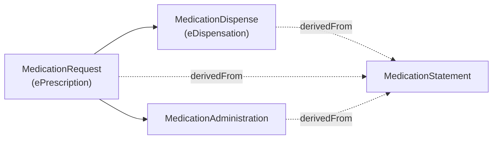

**IE-defined, not HIQA.** The HIQA draft ePrescription and eDispensation standard (September 2026) stops at
dispensing: it has no dataset for giving a medicine or for recording what a patient takes. The two profiles on this
page are this IG's own design (ADR-002). No HIQA element is claimed for the administration profile.

### Medication administration

[IE MPD MedicationAdministration](StructureDefinition-ie-mpd-medicationadministration.html) records a dose given to,
or taken by, a patient under observation, in hospital, a GP practice, a pharmacy or the community. It also records a
dose that was due but **not** given. There is no HL7 Europe MedicationAdministration profile, so it derives from the
FHIR R4 resource and reuses this IG's patient, practitioner, medication and ePrescription profiles.

| Element | Rule |
|---|---|
| `status` | 1..1. `completed` = given; `not-done` = not given; `in-progress` for an infusion under way; `entered-in-error` to retract |
| `statusReason` | Required when the dose was not given (`ie-mad-status-1`), so a missed dose is always explained |
| `medication[x]` | 1..1: an NMPC code, or a reference to a [Medication](StructureDefinition-ie-mpd-medication-eprescription.html) |
| `subject` | 1..1, a [Patient](StructureDefinition-ie-mpd-patient.html) |
| `effective[x]` | 1..1: when the dose was given (or when it was due, if not given) |
| `performer.actor` | Practitioner, PractitionerRole, the patient (self-administration) or a related person (carer) |
| `request` | The [ePrescription item](StructureDefinition-ie-mpd-medicationrequest-eprescription.html) being administered, when there is one |
| `dosage` | What was given: dose or dosage text, required for a given dose (`ie-mad-dose-1`); route, site and rate where known |
{:.grid}

Examples: [dose given](MedicationAdministration-hiqa-mad-s7-salbutamol-given.html) ·
[dose not given](MedicationAdministration-hiqa-mad-s8-dose-not-given.html).

### Medication statement

[IE MPD MedicationStatement](StructureDefinition-ie-mpd-medicationstatement.html) records what a patient is taking,
has taken or intends to take, as reported by the patient, a carer or a clinician: for example, at medicines
reconciliation. It derives from the HL7 Europe Base
[MedicationStatement](http://hl7.eu/fhir/base/StructureDefinition/medicationStatement-eu-core) and traces to the
HIQA draft Patient Summary Section 6.3 (Medication). This IG is not a Patient Summary IG; the PS mapping is carried
in the element comments.

| Element | Rule |
|---|---|
| `status` | 1..1 |
| `medication[x]` | 1..1: an NMPC code, or a reference to a Medication |
| `subject` | 1..1, a Patient |
| `informationSource` | Who reported it: patient, practitioner, role, related person or organisation |
| `dosage` | 1..*, with `dosage.text` 1..1. The dose is MustSupport but not required: requiring it would reject "as directed" statements (OI-017) |
| `derivedFrom` | The prescription, dispense or administration the statement is based on |
{:.grid}

Example: [as-needed salbutamol inhaler](MedicationStatement-hiqa-mst-s9-niamh-salbutamol.html).

### How the events link

`MedicationDispense.authorizingPrescription` and `MedicationAdministration.request` point to the prescription item.
A statement can point to any of the three through `derivedFrom`.
