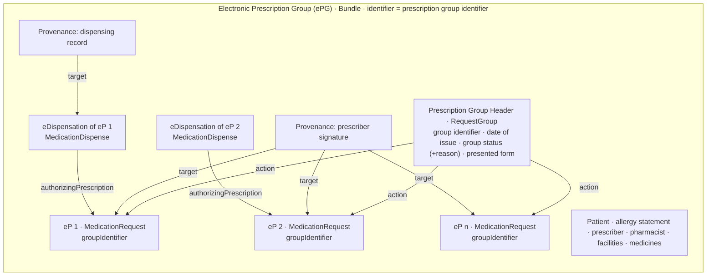

**Based on a consultation draft.** HIQA EP Sections 3 and 6 (September 2026 draft). This page explains how IE MPD
groups electronic prescriptions (ADR-003). Proof of concept; not for clinical use.

### What an Electronic Prescription Group is

An **electronic prescription (eP)** is one prescribed medication: a
[MedicationRequest (ePrescription)](StructureDefinition-ie-mpd-medicationrequest-eprescription.html).

An **Electronic Prescription Group (ePG)** is a Bundle of **one or more electronic prescriptions issued together as
part of the same request**, for example the three medicines a GP prescribes at one consultation. They share one
**prescription group identifier** (each eP's `groupIdentifier`). The ePG also carries the **eDispensations** of those
eP and their **provenance** (the prescriber's signature, who dispensed what and when). It is the
[IE MPD Electronic Prescription Group](StructureDefinition-ie-mpd-electronic-prescription-group.html) profile
(cross-border: [ePG, cross-border](StructureDefinition-ie-mpd-electronic-prescription-group-crossborder.html)).

| Entry | Profile | Cardinality | HIQA EP |
|---|---|---|---|
| **Electronic prescriptions (eP)** | [MedicationRequest (ePrescription)](StructureDefinition-ie-mpd-medicationrequest-eprescription.html) | **1..*** | 3.5, 4, 5 |
| eDispensations of those eP | [MedicationDispense (eDispensation)](StructureDefinition-ie-mpd-medicationdispense-edispensation.html) | 0..* | 6 |
| Provenance | [Provenance](StructureDefinition-ie-mpd-provenance.html); the prescriber's signature is a [signature Provenance](StructureDefinition-ie-mpd-provenance-eprescription-signature.html) | 0..* (1..* cross-border) | 2.13 |
| Prescription group header | [Prescription Group Header](StructureDefinition-ie-mpd-prescription-group-header.html) (RequestGroup) | 1..1 | 3.1 to 3.4 |
| Patient | [Patient (ePrescription)](StructureDefinition-ie-mpd-patient-eprescription.html) | 1..1 | 1 |
| Allergy statement, allergies | [Allergy statement](StructureDefinition-ie-mpd-list-allergies-at-prescribing.html), [AllergyIntolerance](StructureDefinition-ie-mpd-allergyintolerance.html) | 1..1, 0..* | 1.6 |
| Prescriber, pharmacist, facilities | Practitioner, PractitionerRole, Organization | 0..* | 2, 6.4 |
| Medicinal products | [Medication](StructureDefinition-ie-mpd-medication-eprescription.html) | 0..* | 4 |
{:.grid}

### Terms

HIQA's draft calls the group "the electronic prescription" and each eP a "prescription item". This IG uses:

| IE MPD | HIQA EP | FHIR |
|---|---|---|
| Electronic Prescription Group (ePG) | Electronic prescription (Section 3) | Bundle (`IEMpdElectronicPrescriptionGroup`) |
| Prescription group identifier | 3.1 Electronic prescription identifier | `Bundle.identifier` = header `identifier` = every eP's `groupIdentifier` |
| Date of issue | 3.2 Date and time of issuing the prescription | header `authoredOn` = every eP's `authoredOn` |
| Prescription group status (+ reason) | 3.3 Prescription status | header `status` (+ `statusReason` extension) |
| Presented form | 3.4 Presented form | header `presentedForm` extension |
| Electronic prescription (eP) | 3.5 Prescription item | MedicationRequest |
| eP identifier, eP status | 3.5.1, 3.5.2 Prescription item identifier, status | `MedicationRequest.identifier`, `.status` |
| eDispensation | Section 6 Medication dispense | MedicationDispense |
{:.grid}

### Structure

The ePG grows over its life: at issue it holds the eP, the header (and, cross-border, the signature); as eP are
dispensed, their eDispensations and dispensing provenance are added; if the group is cancelled, the header becomes
`revoked` with a reason and its eP are cancelled.

### Why a header

The group-level data HIQA EP Section 3 defines (identifier type, date of issue, a Mandatory status with reason, a
presented form) cannot go on a FHIR R4 Bundle: Bundle is a plain `Resource`, with no `status` and no `extension`. So it
lives in the **Prescription Group Header**, a RequestGroup whose actions list the group's eP.

### Rules

| Invariant | Rule | HIQA |
|---|---|---|
| `ie-bnd-rx-1` | All eP in the ePG share one prescription group identifier | EP 3.1 |
| `ie-bnd-rx-8` | Every eP's `groupIdentifier` is one of the header's identifiers | EP 3.1 |
| `ie-bnd-rx-9` | Every eP has the group's patient, prescriber and date of issue | EP 3.2 |
| `ie-bnd-rx-7` | The header lists every eP in the ePG as an action, and only those | EP 3.5 |
| `ie-bnd-rx-10` (warning) | The group status agrees with the eP: active → an active eP; revoked → only cancelled or stopped eP; completed → no active, on-hold or draft eP | EP 3.3 |
| `ie-grp-status-1` | A group status reason is given unless the group is active, completed or draft | EP 3.3.2 |
| `ie-bnd-rx-11` | The prescriber's facility has an address line, county, postcode and country | EP 2.9 |
| `ie-bnd-rx-12` | Every eDispensation is authorised by an eP in the same ePG | EP 6.5 |
| `ie-bnd-rx-13` | Every eDispensation is for the ePG's patient | patient safety |
| `ie-bnd-rx-14` (warning) | Every Provenance targets resources in the same ePG | — |
| `ie-bnd-xb-2` | Cross-border: a signature Provenance covers every eP | EP 2.13 |
{:.grid}

### Status

| Prescription group (header) | Its eP | Example |
|---|---|---|
| `active` | at least one eP `active` | ePGs 1 to 6 |
| `revoked` (cancelled) + reason | all eP `cancelled` or `stopped` | [ePG 10](Bundle-hiqa-bundle-s10-cancelled.html) |
| `completed` | no eP `active`, `on-hold` or `draft` | — |
| `on-hold`, `entered-in-error`, `unknown` + reason | — | — |
{:.grid}

A declined dispense (scenario 5) is an eDispensation in the ePG with status `declined`; the eP and the group stay
active until the prescriber or the service changes them.

### Examples by interaction

Like the NHS England EPS example catalogue, the ePGs are grouped by what they demonstrate and cross-referenced:

| ePG | Scenario | Contents |
|---|---|---|
| [1](Bundle-hiqa-bundle-s1-acute-adult.html) | Acute adult prescription, dispensed | header, 1 eP, eDispensation, dispensing provenance |
| [2](Bundle-hiqa-bundle-s2-paediatric.html) | Child under 12 (age and weight) | header, 1 eP |
| [3](Bundle-hiqa-bundle-s3-repeat.html) | Repeat prescription: part fill, balance, first repeat | header, 1 eP, three eDispensations |
| [4](Bundle-hiqa-bundle-s4-controlled-drug.html) | Schedule 2 controlled drug, in instalments | header with presented form, 1 eP, first instalment |
| [5](Bundle-hiqa-bundle-s5-non-dispensation.html) | Not dispensed: declined for a recorded penicillin allergy | header, 1 eP, declined eDispensation |
| [6](Bundle-hiqa-bundle-s6-crossborder.html) | Cross-border (IE → EU): two medicines prescribed together | header, **2 eP** (metformin, atorvastatin), prescriber signature over both |
| [10](Bundle-hiqa-bundle-s10-cancelled.html) | Cancelled before dispensing (compare EPS B1/C1) | header `revoked` with reason, 1 eP `cancelled` |
{:.grid}

#### More ePGs with several electronic prescriptions

Each eP is coded with an NMPC VMP (SNOMED CT Irish Edition) through its Medication, which also carries the SNOMED CT
International product or substance and the ATC code (as a coding, or as the HIQA EP 4.2.1 classification); indications, routes and additional instructions are SNOMED CT
codings declaring the Irish Edition; doses use SNOMED CT units of presentation (product-based) or UCUM (strength-based,
liquids). See [Terminology](terminology.html).

| ePG | Group | eP (NMPC VMP) | Shows |
|---|---|---|---|
| [11](Bundle-hiqa-bundle-epg11-cardiometabolic.html) | Cardiovascular and diabetes review | amlodipine 5 mg (267451000220105), ramipril 5 mg (716371000220101), atorvastatin 20 mg (254311000220102), metformin 500 mg (718271000220105) | 4 continuous eP with repeats; at night (`HS`); with food (`311504000`); 2 of 4 already dispensed |
| [12](Bundle-hiqa-bundle-epg12-insulin.html) | Basal-bolus insulin | insulin glargine pen (529881000220106), insulin aspart cartridge (525351000220105) | doses in UCUM `[iU]`; supply in Pen (`733006000`) and Cartridge (`732988008`); three concurrent dosages (`ACM`, `ACD`, `ACV`) |
| [13](Bundle-hiqa-bundle-epg13-sertraline-omeprazole.html) | Depression and reflux (penicillin allergy recorded) | sertraline 50 mg (268301000220104), omeprazole 20 mg (313941000220100) | substitution not allowed with a reason; in the morning (`MORN`); before breakfast (`ACM`, `311501008`); allergy listed in the statement |
| [14](Bundle-hiqa-bundle-epg14-warfarin-lisinopril.html) | Atrial fibrillation and hypertension | warfarin 5 mg (718731000220101), lisinopril 10 mg (714701000220101) | consecutive dosage schemes (sequence 1 loading, sequence 2 maintenance) |
| [15](Bundle-hiqa-bundle-epg15-paediatric.html) | Child under 12 | amoxicillin 250 mg/5 mL suspension (462991000220107), salbutamol inhaler (363291000220101) | age at prescribing on each eP; liquid dose in `mL`; as-needed dose range 1 to 2 actuations with a maximum |
{:.grid}

Administration (scenarios 7, 8) and medication statements (scenario 9) are separate records that point back to an eP;
see [Administration and Statements](administration-and-statements.html).

### Compared with NHS England EPS (reference)

| Topic | NHS England EPS | IE MPD |
|---|---|---|
| The group | No container resource: MedicationRequests share `groupIdentifier` (short-form id; long-form UUID in an extension) | The same shared `groupIdentifier`; the ePG Bundle holds the eP with their eDispensations and provenance, and the header carries the group-level HIQA data |
| Exchange | FHIR messaging: the `prescription-order` MessageDefinition (MessageHeader, 1 to 4 MedicationRequests, Provenance with the signature); dispensing is a separate `dispense-notification` message | One `collection` Bundle per group; HIQA does not specify the national interface (OI-105) |
| Consistency | MedicationRequests must agree on status, intent, category, subject, requester, `groupIdentifier`, course of therapy and validity period | `ie-bnd-rx-1`, `ie-bnd-rx-8`, `ie-bnd-rx-9` |
| Cancellation | `prescription-order-update`; status history extension on each MedicationRequest | Header `revoked` with a reason; eP `cancelled` with a reason |
| Signature | Provenance (advanced electronic signature) targeting the MedicationRequests | Provenance targeting the eP (optionally the header) |
{:.grid}
