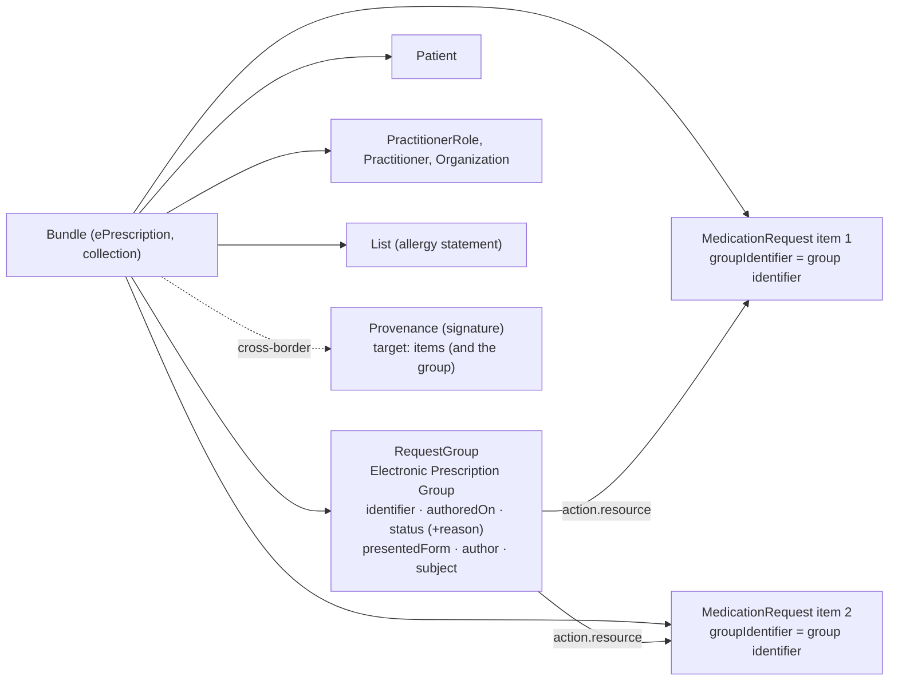

**Based on a consultation draft.** HIQA EP Section 3 (September 2026 draft) describes the prescription as a whole.
This page explains how IE MPD represents it (ADR-003). Proof of concept; not for clinical use.

### Why a prescription group

An electronic prescription has data that belongs to the prescription, not to one item: its identifier, when it was
issued, its status and a printable copy. HIQA EP Section 3 defines them:

| HIQA EP | Element | Conformance | IE MPD |
|---|---|---|---|
| 3.1 | Electronic prescription identifier (type 3.1.1, value 3.1.2) | Mandatory 1..* | `RequestGroup.identifier` (type, system, value 1..1) |
| 3.2 | Date and time of issuing the prescription | Mandatory | `RequestGroup.authoredOn` |
| 3.3 / 3.3.1 | Prescription status | Mandatory | `RequestGroup.status` |
| 3.3.2 / 3.3.3 | Status reason (coded; free text) | Required; Optional | extension [`statusReason`](StructureDefinition-ie-mpd-prescription-group-status-reason.html) |
| 3.4 | Presented form | Optional | extension [`presentedForm`](StructureDefinition-ie-mpd-presented-form.html) (Attachment) |
| 3.5 | Prescription items | Mandatory 1..* | `RequestGroup.action.resource` → [MedicationRequest (ePrescription)](StructureDefinition-ie-mpd-medicationrequest-eprescription.html) |
{:.grid}

A FHIR R4 Bundle cannot hold these: it is a plain `Resource` with no `extension` or `status`. So the
[Electronic Prescription Group](StructureDefinition-ie-mpd-electronic-prescription-group.html), a
**RequestGroup**, travels as an entry in the [ePrescription Bundle](StructureDefinition-ie-mpd-bundle-eprescription.html),
next to the items it groups.

### Structure

### Rules

| Invariant | Rule | HIQA |
|---|---|---|
| `ie-bnd-rx-7` | The group lists every item in the Bundle as an action, and only those | EP 3.5 |
| `ie-bnd-rx-8` | Every item's `groupIdentifier` is one of the group's identifiers | EP 3.1 |
| `ie-bnd-rx-9` | Every item has the group's patient, prescriber and date of issue | EP 3.2 |
| `ie-bnd-rx-10` (warning) | The group status agrees with the items: active → an active item; revoked → only cancelled or stopped items; completed → no active, on-hold or draft item | EP 3.3 |
| `ie-grp-status-1` | A status reason is given unless the prescription is active, completed or draft | EP 3.3.2 |
| `ie-bnd-rx-11` | The prescriber's facility (organisation of the prescriber's role) has an address line, county, postcode and country | EP 2.9 |
{:.grid}

### Status

| Prescription (group) | Items | Example |
|---|---|---|
| `active` | at least one item `active` | scenarios 1 to 6 |
| `revoked` (cancelled) + reason | all items `cancelled` or `stopped` | [scenario 10](Bundle-hiqa-bundle-s10-cancelled.html) |
| `completed` | no item `active`, `on-hold` or `draft` | — |
| `on-hold`, `entered-in-error`, `unknown` + reason | — | — |
{:.grid}

Dispensing does not change the prescription's status by itself: a declined dispense (scenario 5) is recorded on the
MedicationDispense, and the prescription stays active until the prescriber or the service changes it.

### Compared with NHS England EPS (reference)

The NHS England Electronic Prescription Service (EPS) was reviewed as a reference:

| Topic | NHS England EPS | IE MPD |
|---|---|---|
| The prescription | No container resource: items share `MedicationRequest.groupIdentifier` (short-form id, long-form UUID in an extension) | The same shared `groupIdentifier`, plus a RequestGroup that holds the prescription-level HIQA data |
| Exchange | FHIR messaging: `prescription-order` MessageDefinition (MessageHeader, 1 to 4 MedicationRequests, Provenance with the signature) | A `collection` Bundle; HIQA does not specify the national interface (OI-105) |
| Item consistency | The items must agree on status, intent, category, subject, requester, `groupIdentifier`, course of therapy and validity period | `ie-bnd-rx-1`, `ie-bnd-rx-8`, `ie-bnd-rx-9` |
| Cancellation | `prescription-order-update`; status history extension on each item | Group `revoked` with a reason; items `cancelled` with a reason (scenario 10) |
| Signature | Provenance (advanced electronic signature) targeting the items | Provenance targeting the items, optionally the group (HIQA EP 2.13) |
{:.grid}

### Examples by interaction

Like the EPS example catalogue, the scenarios are grouped by what they demonstrate and cross-referenced:

| Interaction | Scenario | Example |
|---|---|---|
| Prescribe | 1 acute; 2 paediatric; 3 repeat; 4 controlled drug (with presented form); 6 cross-border, two items | Bundles [1](Bundle-hiqa-bundle-s1-acute-adult.html) · [2](Bundle-hiqa-bundle-s2-paediatric.html) · [3](Bundle-hiqa-bundle-s3-repeat.html) · [4](Bundle-hiqa-bundle-s4-controlled-drug.html) · [6](Bundle-hiqa-bundle-s6-crossborder.html) |
| Cancel the prescription | 10 cancels a prescription before dispensing | [Bundle 10](Bundle-hiqa-bundle-s10-cancelled.html) · [group](RequestGroup-hiqa-grp-s10-cancelled.html) |
| Dispense | 1 dispenses 1; 3 part fill, balance and repeat of 3; 4 instalment of 4 | [1](MedicationDispense-hiqa-md-s1-amoxicillin.html) · [3a](MedicationDispense-hiqa-md-s3-part-fill.html) [3b](MedicationDispense-hiqa-md-s3-balance.html) [3c](MedicationDispense-hiqa-md-s3-repeat-1.html) · [4](MedicationDispense-hiqa-md-s4-instalment-1.html) |
| Not dispensed | 5 declines prescription 5 (penicillin allergy) | [5](MedicationDispense-hiqa-md-s5-declined.html) |
| Administer | 7 given (against prescription 3); 8 not given (against prescription 1) | [7](MedicationAdministration-hiqa-mad-s7-salbutamol-given.html) · [8](MedicationAdministration-hiqa-mad-s8-dose-not-given.html) |
| Record what is taken | 9 medication statement | [9](MedicationStatement-hiqa-mst-s9-niamh-salbutamol.html) |
{:.grid}
