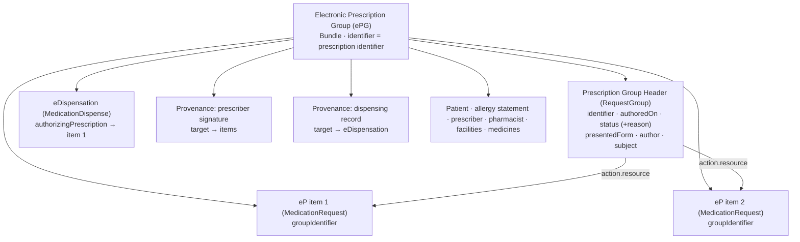

**Based on a consultation draft.** HIQA EP Sections 3 and 6 (September 2026 draft). This page explains how IE MPD
groups an electronic prescription with everything that belongs to it (ADR-003). Proof of concept; not for clinical use.

### What an Electronic Prescription Group is

An **Electronic Prescription Group (ePG)** is a Bundle of one prescription's electronic prescriptions (eP, the
prescription items) together with their **eDispensations** and **provenance**: who signed, who dispensed, and when.
It is the [IE MPD Electronic Prescription Group](StructureDefinition-ie-mpd-electronic-prescription-group.html)
profile (cross-border: [ePG, cross-border](StructureDefinition-ie-mpd-electronic-prescription-group-crossborder.html)).

| Entry | Profile | Cardinality | HIQA EP |
|---|---|---|---|
| Prescription group header | [Prescription Group Header](StructureDefinition-ie-mpd-prescription-group-header.html) (RequestGroup) | 1..1 | 3.1 to 3.5 |
| Electronic prescriptions (items) | [MedicationRequest (ePrescription)](StructureDefinition-ie-mpd-medicationrequest-eprescription.html) | 1..* | 3.5, 4, 5 |
| eDispensations | [MedicationDispense (eDispensation)](StructureDefinition-ie-mpd-medicationdispense-edispensation.html) | 0..* | 6 |
| Provenance | [Provenance](StructureDefinition-ie-mpd-provenance.html); the prescriber's signature is a [signature Provenance](StructureDefinition-ie-mpd-provenance-eprescription-signature.html) | 0..* (1..* cross-border) | 2.13 |
| Patient | [Patient (ePrescription)](StructureDefinition-ie-mpd-patient-eprescription.html) | 1..1 | 1 |
| Allergy statement, allergies | [Allergy statement](StructureDefinition-ie-mpd-list-allergies-at-prescribing.html), [AllergyIntolerance](StructureDefinition-ie-mpd-allergyintolerance.html) | 1..1, 0..* | 1.6 |
| Prescriber, dispenser, facilities | Practitioner, PractitionerRole, Organization | 0..* | 2, 6.4 |
| Medicinal products | [Medication](StructureDefinition-ie-mpd-medication-eprescription.html) | 0..* | 4 |
{:.grid}

### Why a header

HIQA EP Section 3 gives the prescription data that belongs to the prescription, not to one item: its identifier,
date and time of issue, a Mandatory prescription status with reason, and a presented form. A FHIR R4 Bundle cannot
hold these: it is a plain `Resource`, with no `status` and no `extension`. So they live in the ePG's
**Prescription Group Header**, a RequestGroup whose actions point to the items:

| HIQA EP | Element | Conformance | Header element |
|---|---|---|---|
| 3.1 | Electronic prescription identifier (type 3.1.1, value 3.1.2) | Mandatory 1..* | `identifier` (type, system, value 1..1); repeated in `Bundle.identifier` and every item's `groupIdentifier` |
| 3.2 | Date and time of issuing the prescription | Mandatory | `authoredOn` |
| 3.3 / 3.3.1 | Prescription status | Mandatory | `status` |
| 3.3.2 / 3.3.3 | Status reason (coded; free text) | Required; Optional | extension [`statusReason`](StructureDefinition-ie-mpd-prescription-group-status-reason.html) |
| 3.4 | Presented form | Optional | extension [`presentedForm`](StructureDefinition-ie-mpd-presented-form.html) (Attachment) |
| 3.5 | Prescription items | Mandatory 1..* | `action.resource` → each item |
{:.grid}

### Structure

The ePG grows over the prescription's life: at issue it holds the header and the items (and, cross-border, the
signature); as items are dispensed, their eDispensations and dispensing provenance are added; if the prescription is
cancelled, the header becomes `revoked` with a reason.

### Rules

| Invariant | Rule | HIQA |
|---|---|---|
| `ie-bnd-rx-1` | All items share one group identifier | EP 3.1 |
| `ie-bnd-rx-7` | The header lists every item as an action, and only those | EP 3.5 |
| `ie-bnd-rx-8` | Every item's `groupIdentifier` is one of the header's identifiers | EP 3.1 |
| `ie-bnd-rx-9` | Every item has the header's patient, prescriber and date of issue | EP 3.2 |
| `ie-bnd-rx-10` (warning) | The prescription status agrees with the items: active → an active item; revoked → only cancelled or stopped items; completed → no active, on-hold or draft item | EP 3.3 |
| `ie-grp-status-1` | A status reason is given unless the prescription is active, completed or draft | EP 3.3.2 |
| `ie-bnd-rx-11` | The prescriber's facility has an address line, county, postcode and country | EP 2.9 |
| `ie-bnd-rx-12` | Every eDispensation is authorised by an item in the same ePG | EP 6.5 |
| `ie-bnd-rx-13` | Every eDispensation is for the ePG's patient | patient safety |
| `ie-bnd-rx-14` (warning) | Every Provenance targets resources in the same ePG | — |
| `ie-bnd-xb-2` | Cross-border: a signature Provenance covers every item | EP 2.13 |
{:.grid}

### Status

| Prescription (header) | Items | Example |
|---|---|---|
| `active` | at least one item `active` | scenarios 1 to 6 |
| `revoked` (cancelled) + reason | all items `cancelled` or `stopped` | [scenario 10](Bundle-hiqa-bundle-s10-cancelled.html) |
| `completed` | no item `active`, `on-hold` or `draft` | — |
| `on-hold`, `entered-in-error`, `unknown` + reason | — | — |
{:.grid}

A declined dispense (scenario 5) is an eDispensation in the ePG with status `declined`; the prescription stays active
until the prescriber or the service changes it.

### Examples by interaction

Like the NHS England EPS example catalogue, the ePGs are grouped by what they demonstrate and cross-referenced:

| ePG | Scenario | Contents |
|---|---|---|
| [1](Bundle-hiqa-bundle-s1-acute-adult.html) | Acute adult prescription, dispensed | header, item, eDispensation, dispensing provenance |
| [2](Bundle-hiqa-bundle-s2-paediatric.html) | Child under 12 (age and weight) | header, item |
| [3](Bundle-hiqa-bundle-s3-repeat.html) | Repeat prescription: part fill, balance, first repeat | header, item, three eDispensations |
| [4](Bundle-hiqa-bundle-s4-controlled-drug.html) | Schedule 2 controlled drug, in instalments | header with presented form, item, first instalment |
| [5](Bundle-hiqa-bundle-s5-non-dispensation.html) | Not dispensed: declined for a recorded penicillin allergy | header, item, declined eDispensation |
| [6](Bundle-hiqa-bundle-s6-crossborder.html) | Cross-border (IE → EU), two items | header, two items, prescriber signature |
| [10](Bundle-hiqa-bundle-s10-cancelled.html) | Cancelled before dispensing (compare EPS B1/C1) | header `revoked` with reason, item `cancelled` |
{:.grid}

Administration (scenarios 7, 8) and medication statements (scenario 9) are separate records that point back to the
items; see [Administration and Statements](administration-and-statements.html).

### Compared with NHS England EPS (reference)

| Topic | NHS England EPS | IE MPD |
|---|---|---|
| The prescription | No container resource: items share `MedicationRequest.groupIdentifier` (short-form id; long-form UUID in an extension) | The same shared `groupIdentifier`; the ePG Bundle groups the items with their dispensations and provenance, and the header carries the prescription-level HIQA data |
| Exchange | FHIR messaging: the `prescription-order` MessageDefinition (MessageHeader, 1 to 4 MedicationRequests, Provenance with the signature); dispensing is a separate `dispense-notification` message | One `collection` Bundle per prescription; HIQA does not specify the national interface (OI-105) |
| Item consistency | Items must agree on status, intent, category, subject, requester, `groupIdentifier`, course of therapy and validity period | `ie-bnd-rx-1`, `ie-bnd-rx-8`, `ie-bnd-rx-9` |
| Cancellation | `prescription-order-update`; status history extension on each item | Header `revoked` with a reason; items `cancelled` with a reason |
| Signature | Provenance (advanced electronic signature) targeting the items | Provenance targeting the items (optionally the header) |
{:.grid}
