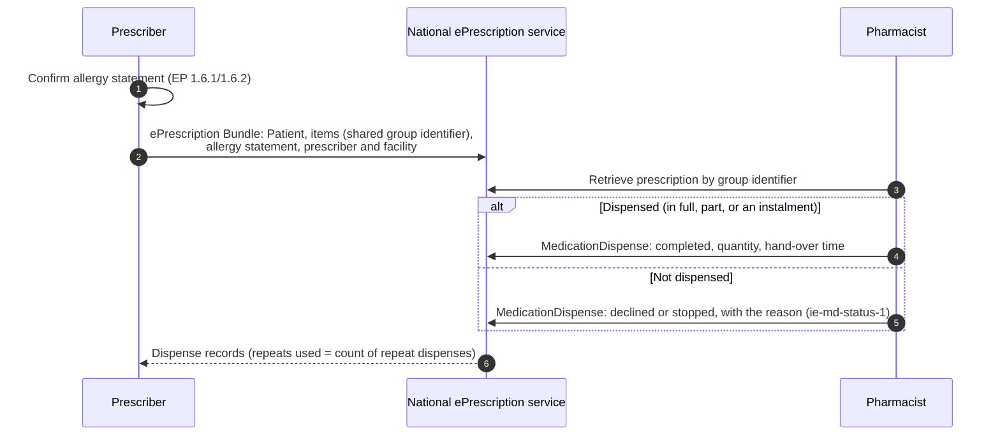

**Based on a consultation draft.** HIQA published the *Draft National Standard for Electronic Prescriptions and
Electronic Dispensations* for public consultation in September 2026. It will change after consultation, and this
page will change with it. This IG is a proof of concept. It is not affiliated with, or endorsed by, HIQA, the HSE,
HL7 Ireland, HL7 Europe or the Department of Health.

### Rules this IG follows

- **Trace every element.** Each of the 242 HIQA EP data elements maps to an element here, or is recorded as a gap.
  See [HIQA Traceability](hiqa-traceability.html) for the counts and every row.
- **Send only the dataset.** An ePrescription carries only the HIQA EP patient dataset. See
  [Data Minimisation](data-minimisation.html).
- **Invent nothing.** SNOMED CT, LOINC and UCUM codes are checked on tx.fhir.org; NMPC codes are checked in the NMPC
  Meds Catalogue (see [Terminology](terminology.html)). Where HIQA does not settle a question, the IG uses a
  clearly named placeholder and logs it in [Open Issues](open-issues.html).
- **Build on Europe.** The prescription, dispense and medication profiles derive from HL7 Europe MPD 1.0.0, so an
  Irish ePrescription is also a valid European one.

### How HIQA maps to this IG

| HIQA EP | IE MPD |
|---|---|
| Section 1: Patient | [Patient (ePrescription)](StructureDefinition-ie-mpd-patient-eprescription.html): the EP dataset only |
| 1.6: Clinical information (allergies, weight, height) | [Allergy statement](StructureDefinition-ie-mpd-list-allergies-at-prescribing.html) required on every prescription; [AllergyIntolerance](StructureDefinition-ie-mpd-allergyintolerance.html); [body weight](StructureDefinition-ie-mpd-body-weight.html) and [body height](StructureDefinition-ie-mpd-body-height.html) |
| Section 2: Health practitioner | [Practitioner](StructureDefinition-ie-mpd-practitioner.html) (IMC, PSI, NMBI, Dental Council), [PractitionerRole](StructureDefinition-ie-mpd-practitionerrole.html), [Organization](StructureDefinition-ie-mpd-organization.html) (PSI RPB, GMS Panel), [Location](StructureDefinition-ie-mpd-location.html) (GLN) |
| Section 3: The prescription as a whole (identifier, date of issue, status, presented form) | [Electronic Prescription Group](StructureDefinition-ie-mpd-electronic-prescription-group.html) in the [ePrescription Bundle](StructureDefinition-ie-mpd-bundle-eprescription.html); see [Electronic Prescription Group](electronic-prescription-group.html) |
| Sections 3.5–5: Prescription items, medication, dosage | [MedicationRequest (ePrescription)](StructureDefinition-ie-mpd-medicationrequest-eprescription.html), [Medication](StructureDefinition-ie-mpd-medication-eprescription.html), [Dosage](StructureDefinition-ie-mpd-dosage.html); see [Dosage](dosage.html) |
| 2.13: Signature, cross-border | [Signature Provenance](StructureDefinition-ie-mpd-provenance-eprescription-signature.html), [cross-border Bundle](StructureDefinition-ie-mpd-bundle-eprescription-crossborder.html) |
| Section 6: Dispensation | [MedicationDispense (eDispensation)](StructureDefinition-ie-mpd-medicationdispense-edispensation.html) |
| Element by element | Logical model [HIQAEPrescriptionLM](StructureDefinition-HIQAEPrescriptionLM.html) |
{:.grid}

### Rules enforced as invariants

| Invariant | Rule | HIQA |
|---|---|---|
| `ie-bnd-rx-1` | A multi-item prescription shares one group identifier | EP 3.1 |
| `ie-bnd-rx-2`, `ie-list-allergy-1`, `ie-bnd-rx-6` | Every item references the allergy statement; it lists allergies or says why none are recorded; every listed allergy is in the Bundle | EP 1.6.1, 1.6.2 |
| `ie-bnd-rx-3`, `ie-rx-age-1` | The patient's age is recorded if under 12, or if the date of birth is not a full date | EP 1.4.2 |
| `ie-bnd-rx-4` | The prescriber has a telephone number | EP 2.10, 2.10.1 |
| `ie-bnd-rx-5` | Every item and allergy is about the one patient in the Bundle | patient safety |
| `ie-bnd-xb-1`, `ie-bnd-xb-2` | A cross-border prescription gives a secure email and carries the prescriber's signature | EP 2.10.2, 2.13 |
| `ie-rx-status-1` | A status reason is given unless the item is active, completed or draft | EP 3.5.2.2, 3.5.2.3 |
| `ie-rx-dosage-1`, `ie-dos-1` to `ie-dos-4` | Structured dosage comes with text; a frequency has its period; as-needed dosing states a maximum (warning); a dose range has both ends | EP 5.1, 5.2.3.1.2, 5.2.4.3 |
| `ie-bnd-rx-7` to `ie-bnd-rx-10`, `ie-grp-status-1` | The prescription group lists exactly the items; items share its identifier, patient, prescriber and date of issue; its status agrees with theirs (warning); a reason is given unless active, completed or draft | EP 3.1 to 3.5 |
| `ie-bnd-rx-11` | The prescriber's facility has an address line, county, postcode and country | EP 2.9 |
| `ie-allergy-2` | An allergy's record entry author and date are given together | EP 1.6.2.4.2, 1.6.2.4.3 |
| `ie-rx-subst-1` | "Do not substitute" gives a reason | EP 3.5.10.3 |
| `ie-rx-cd-1`, `ie-rx-cd-2`, `ie-rx-cd-3` | Controlled drugs: quantity in words and figures; validity period; number of instalments | EP 3.5.7.2, 3.5.9.1, 3.5.12 |
| `ie-md-status-1`, `ie-md-handover-1` | A non-dispensation states the reason; a completed dispense records the hand-over time | EP 6.3.2, 6.8 |
| `ie-pat-1`, `ie-pat-ppsn-1`, `ie-prac-psi-1`, `ie-loc-gln-1` | Identifier formats: IHI, PPSN, PSI number, GLN | EP 1.3.1, 1.3.2, 2.6.2, 2.11 |
{:.grid}

The controlled-drug rules use the conservative readings recorded in open issue OI-027.

### Prescribe and dispense

The participants are roles, not real systems. The HIQA draft does not specify the national service's interface, so
it is out of scope here.

### Scenario examples

| # | Scenario | Example |
|---|---|---|
| 1 | Acute adult prescription, dispensed | [Bundle](Bundle-hiqa-bundle-s1-acute-adult.html) · [dispense](MedicationDispense-hiqa-md-s1-amoxicillin.html) |
| 2 | Child under 12: age and weight recorded | [Bundle](Bundle-hiqa-bundle-s2-paediatric.html) |
| 3 | Repeat prescription: part fill, balance, first repeat | [Bundle](Bundle-hiqa-bundle-s3-repeat.html) · dispenses [1](MedicationDispense-hiqa-md-s3-part-fill.html) [2](MedicationDispense-hiqa-md-s3-balance.html) [3](MedicationDispense-hiqa-md-s3-repeat-1.html) |
| 4 | Schedule 2 controlled drug, in instalments | [Bundle](Bundle-hiqa-bundle-s4-controlled-drug.html) · [instalment 1](MedicationDispense-hiqa-md-s4-instalment-1.html) |
| 5 | Not dispensed: the pharmacist declines because of a recorded penicillin allergy | [Bundle](Bundle-hiqa-bundle-s5-non-dispensation.html) · [declined dispense](MedicationDispense-hiqa-md-s5-declined.html) |
| 6 | Cross-border (IE → EU) with the prescriber's signature | [Bundle](Bundle-hiqa-bundle-s6-crossborder.html) |
| 7 | Dose given (IE-defined) | [MedicationAdministration](MedicationAdministration-hiqa-mad-s7-salbutamol-given.html) |
| 8 | Dose not given, with the reason (IE-defined) | [MedicationAdministration](MedicationAdministration-hiqa-mad-s8-dose-not-given.html) |
| 9 | Medication statement (as-needed inhaler) | [MedicationStatement](MedicationStatement-hiqa-mst-s9-niamh-salbutamol.html) |
| 10 | Prescription cancelled before dispensing: group revoked with a reason | [Bundle](Bundle-hiqa-bundle-s10-cancelled.html) · [group](RequestGroup-hiqa-grp-s10-cancelled.html) |
{:.grid}

Scenarios 7–9 are not HIQA EP scenarios; see [Administration and Statements](administration-and-statements.html).
All people, organisations and identifiers are fictional.
